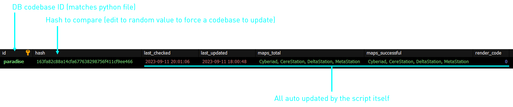

# SS13 WebMap Backend

## 1. What is this thing?

This horrific pile of code is the backend for the [webmap](https://github.com/AffectedArc07/SS13WebMap). In short, it:

- Runs on a CRON schedule (currently every hour)
- Checks every codebase's `maps` (or `_maps`) folder hash with a local hash in the DB.
- If a codebase is due to be updated, its local git is updated.
  - Local git repos are stored in the `codebases` dir.
- After this, each map defined in `main.py` is rendered, cloned to `out`, and appended with the `-pipe` suffix if required.
- This process is repeated for each codebase with a pending update.
- After this, all files are synced to a remote server with `sync.sh`.
- A log of all activity is also placed into the database, as well as logging for each codebase of which maps were successful or not.

## 2. How do I use it?

This only runs on Linux. You might be able to finesse it into working with WSL but theres no guarantees. It also needs MySQL/MariaDB to run.

1. Run `install.sh` to setup the environment.
2. Copy `run.sh.example` to `run.sh` and edit it to suit your environment.
3. Copy `config.toml.example` to `config.toml` and edit it to suit your needs.
4. Create the following directories in the app workdir: `codebases`, `executables`, `out`.
5. Import the `schema.sql` file into your database server.
6. Comment out all the codebases you aren't planning to test.
7. Clone the git repos of the codebases you do want to test into the `codebases` folder, making sure the codebase folder matches the declaration (see section `3.A`).
8. Insert the relevant DB rows (see section `3.B`).
9. Compile [dmm-tools](https://github.com/Spacemaniac/SpacemanDMM) and place it into executables as `renderer-tg`.
10. Make sure that the `fancy` flag for the codebases you are testing is set to `False`. This is because I cannot distribute the modified `-pipe` renderers.
11. Copy `sync.sh.example` to `sync.sh` and edit it to suit your environment. This could also mean making the file do nothing.
12. Run `run.sh` and hope for the best.

## 3. Explanation of relevant pieces

### A. Codebase

### B. DB Row

## 4. Why is this code so bad?

I wrote this in one day to replace the [awful](https://gist.github.com/AffectedArc07/4a6be558d78ee9e6eb7fcc33fc5defdf) and [terribly written](https://gist.github.com/AffectedArc07/2fb5a80dd94a65ebdb73d0c5303acb6f) code I made in the first iteration of the webmap upater.

This code is still awful, and there are a number of things I can do to it, most notably:

- Not hardcode directories.
- Make the folders autocreate.
- Maybe add an ORM for the database now its soft open source.
- Maybe upgrade the system to place files onto an Azure blob storage account instead of rsync to another server.
- Maybe move the codebases out of `main.py` and put them into a json or toml file or similar.
- ~~Maybe rewrite the entire thing in rust to use dmm-tools from an in-code API, but then coderbus will probably do it some day anyway.~~

However, there are some things I want to do, most notably:

- [ ] Modify [dmm-tools](https://github.com/Spacemaniac/SpacemanDMM) to add a single `pipenet` pass that enables pipes *and* wires.
- [ ] Remove the need for custom `dmm-tools` versions and have every codebase use the default (TG) variant [now that it can be configured](https://github.com/ParadiseSS13/Paradise/blob/master/SpacemanDMM.toml).
- [ ] Make codebase checking async to save that bit more time.

Will this ever be worked on? Probably not, but by open sourcing it, it might give me a drive to improve it, or I can atleast let people modify their own codebases as they add and remove maps. Also something something bus factor.

## 5. How do I contribute?

1. Accept the fact you are utterly insane.
2. Test your changes as per section `2`.
3. Make a PR with your changes outlined.
4. Profit

## 6. License

This software is licensed under MIT. You can find a copy in [LICENSE.md](LICENSE.MD).
